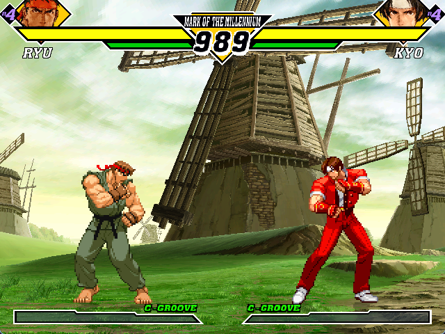

### Fightcade 2: CVS2
Download the latest release:
 * CVS1 palettes in CVS2 (https://t.ly/7Huhu)

* The 7z contains an edited CHD file
* Goto \emulator\flycast\ROMs\cvs2 inside your fightcade folder
* Replace the gdl-0008.chd with the from the 7z archive and you'll be done!

